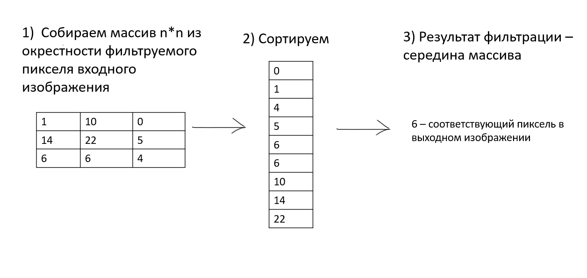
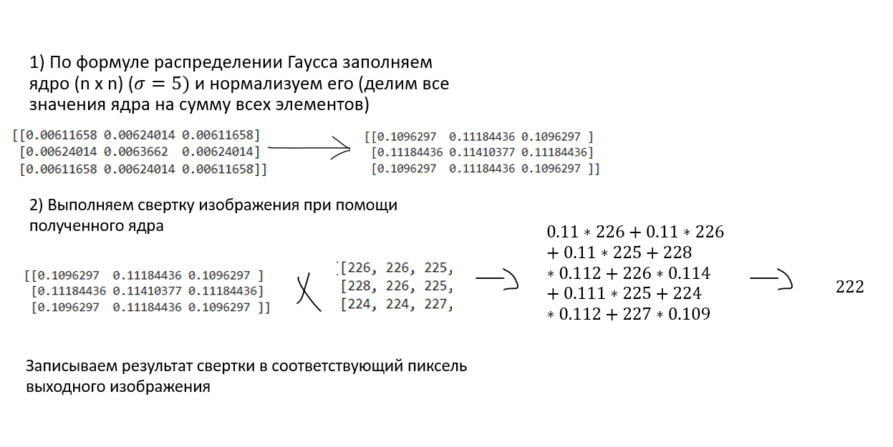
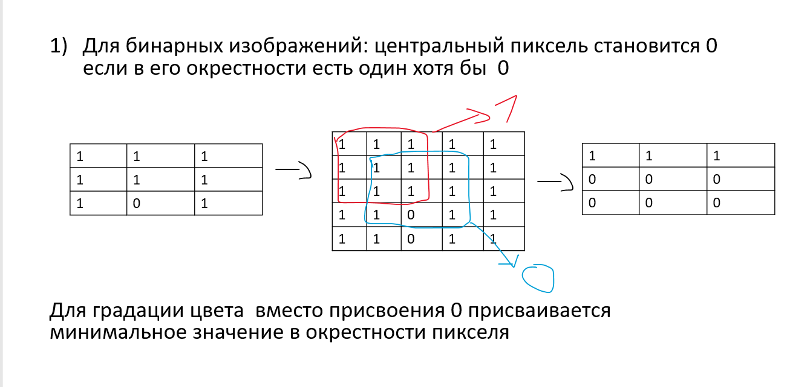
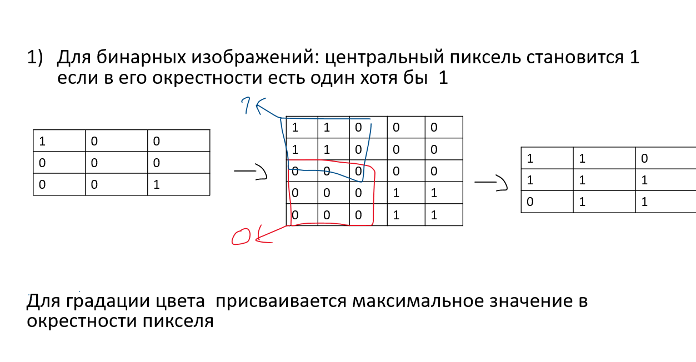
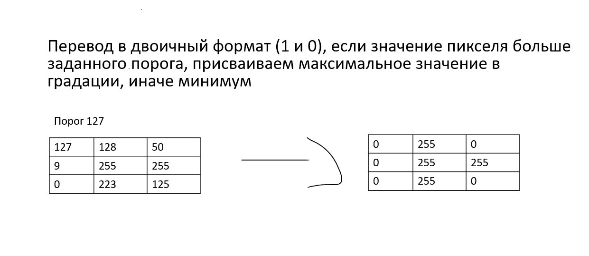
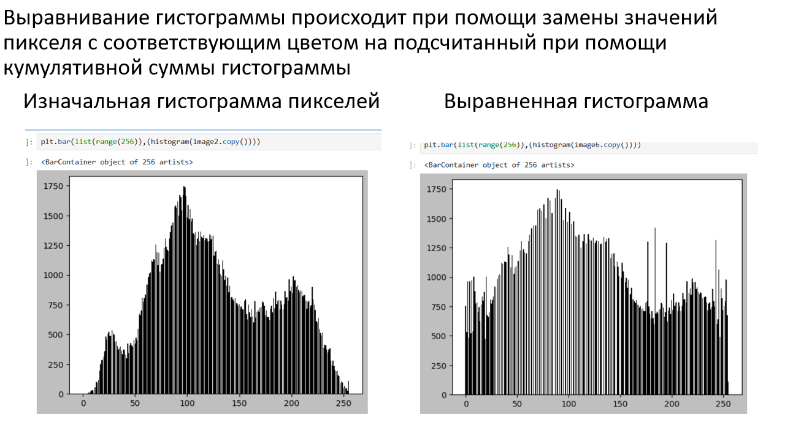
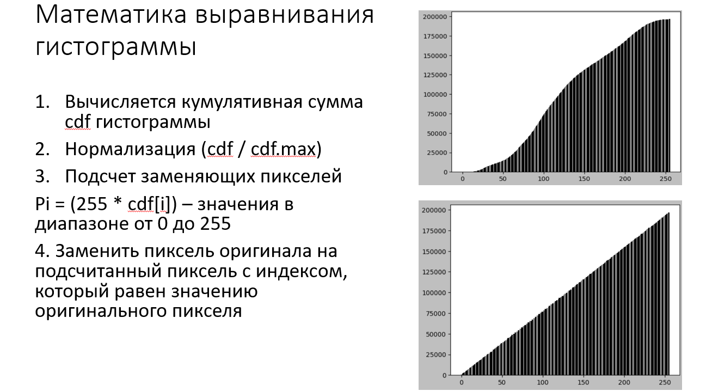
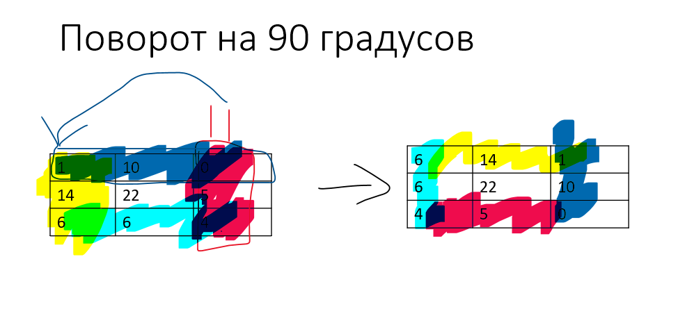

### Лабораторные работы по компьютерному зрению

# Лабораторная работа №1
[Файл notebook лаб№1](../notebook/LAB№1.ipynb)

Реализовать следующие функции для обработки изображения в формате RGB:
1. Медианный фильтр
2. Фильтр гаусса
3. Эрозия
4. Дилатация
5. Пороговая бинаризация (для rgb и grayscale изображения)
6. Выравнивание гистограммы
7. Поворот изображений на угол кратный 90 градусов
 
Предварительно входное изображение подвергнуто паддингу, добавлены дополнительные пиксели идентичные пограничным.
### Медианный фильтр
Фильтрация происходит в окрестности (размер окрестности n x n) пикселя, собираются значения всех пикселей в окрестности в массив, массив сортируется и выбирается значение, находящееся в середине массива. Таким образом сортируется каждый пиксель. Предварительно изображение могут подвергнуть паддингу.

### Фильтр гаусса
Гауссова фильтрация изображения происходит при помощи свертки и ядра, значения которой вычисляются по функции Гаусса. Значения в ядре для свертки согласно функции Гаусса зависят от положения относительно центра, чем дальше от центра, тем меньше влияние пикселя при свертке. Функция Гаусса:

$$g(x,y)=\frac{1}{2\pi\sigma^2}  {e}^{-\frac{x^2+y^2}{2\sigma^2}} $$

$$filtersize = 3 $$

$$\sigma = 5 $$

### Эрозия
Эрозия - морфологическая операция, осуществляющая поиск минимального значения пикселя в окрестности, и когда поиск окончен приравнивает центральное значение к минимальному. Таким образом обрабатывается каждый пиксель в изображении.

### Дилатация
Дилатация - морфологическая операция, осуществляющая поиск максимального значения пикселя в окрестности, и когда поиск окончен приравнивает центральное значение к минимальному. Таким образом обрабатывается каждый пиксель в изображении.

### Пороговая бинаризация (для rgb и grayscale изображения)
Пороговая бинаризация - это операция по присваению максимального и минимального значения пикселя относительно порогового значения, если больше, то макс., если меньше то мин. Для RGB бинаризация происходила для 3 каналов, для серого возможно только для 1 канала.

### Выравнивание гистограммы
Выравнивание гистограммы - это операция по усреднению значений всех пикселей в изображении согласно кумулятивной функции распределения, подсчитанная при помощи гистограммы всех пикселей всех 3 каналов. Результат для пикселей будет определяться при помощи составленного одномерного массива на 256 значений, пиксель - индекс, значение пикселя - это значение под данным индексом. Кумулятивную функцию распределения пришлось нормализовать, так как в конце массива значения получились на несколько порядков больше чем 256.

### Поворот изображений на угол кратный 90 градусов
Поворот осуществлялся при помощи создания пустого, но идентичного размером изображения, значения присваивались при помощи цикла for, если для оригинального значения i - индекс для стоблцов j - индекс для строк, то для нового наоборот i - индекс для строк j - индекс для столбцов, таким образом можно "повернуть" изображение на 90 градусов по часовой стрелке.

