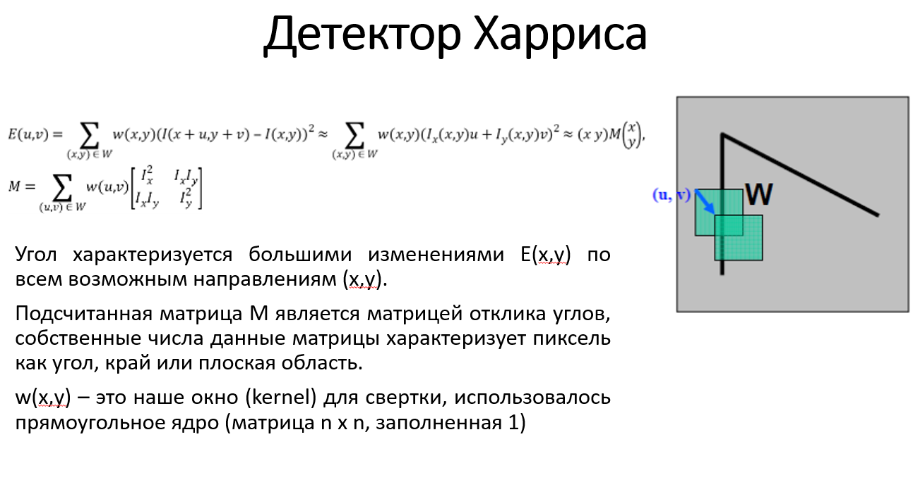
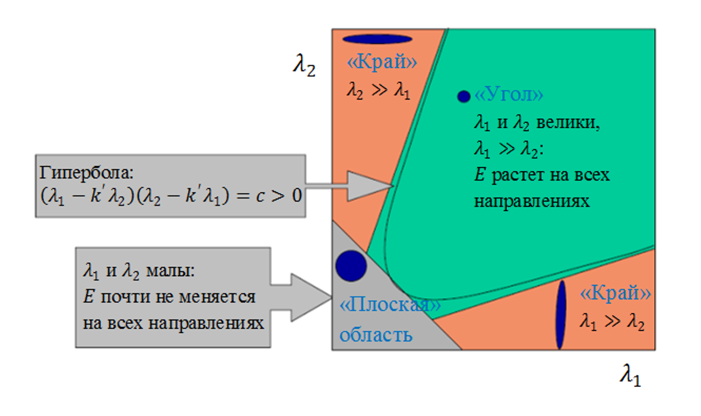
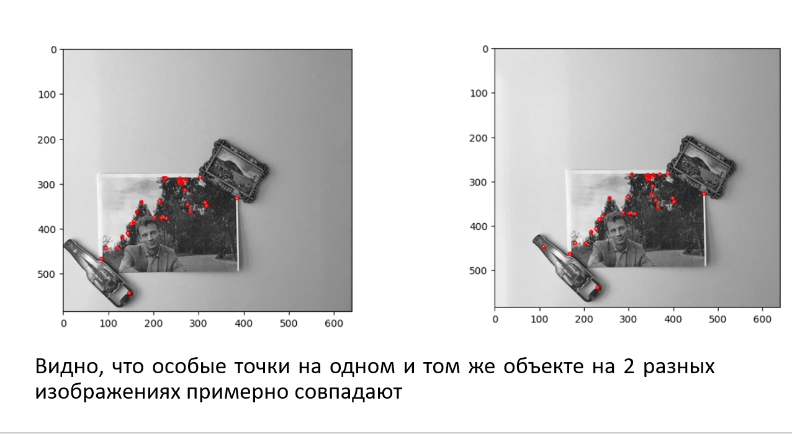
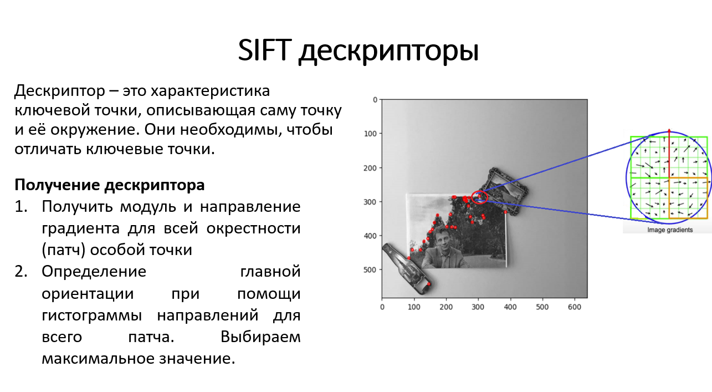
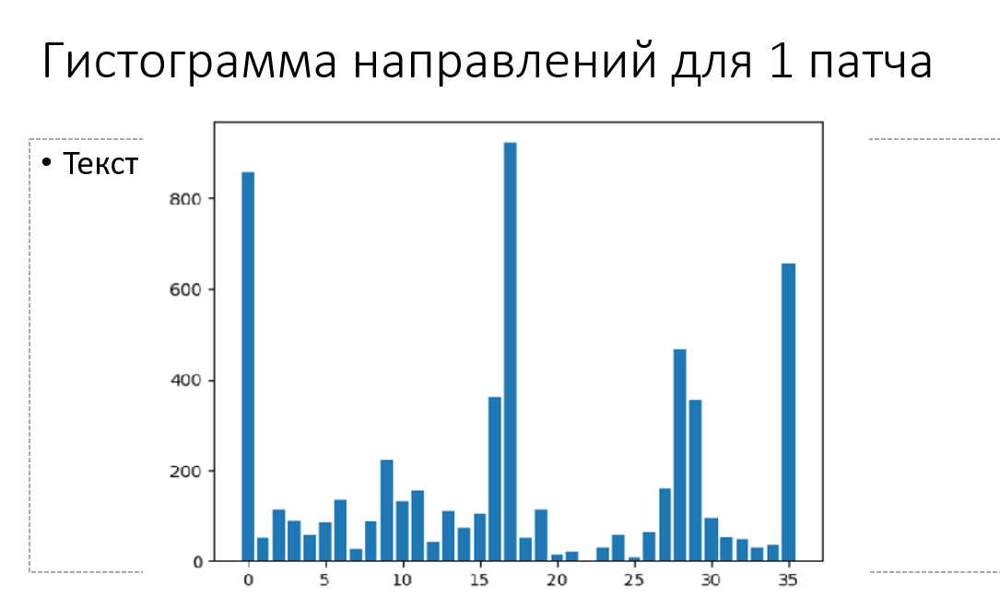
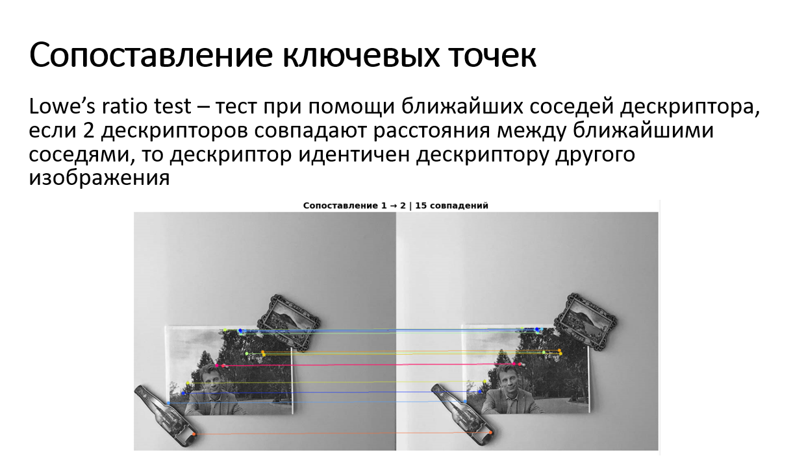
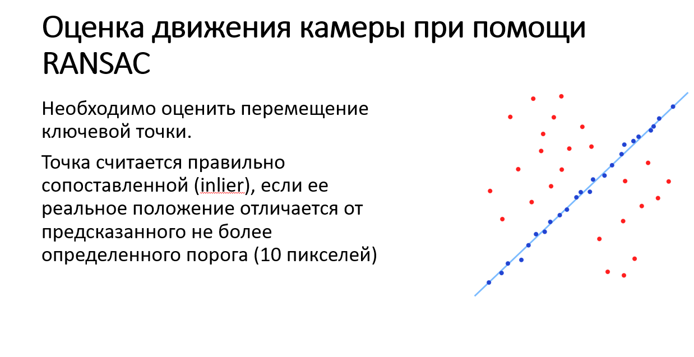
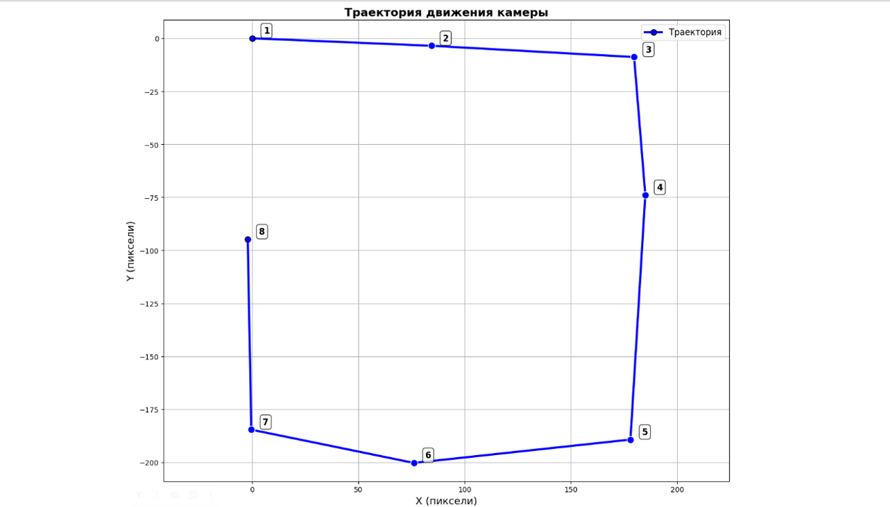

# Лабораторная работа №2
[Файл notebook лаб№2](../notebook/LAB№2_1.0.ipynb.ipynb)

Цель: Разработать систему визуальной одометрии (навигации) по группе фотографий.
Используя данные фотографии реализуйте следующее:
1.	Определите на каждой фотографии ключевые точки
2.	Отфильтруйте самые наилучшие применяю адаптивный радиус и локальные максимумы, не забудьте так же выровнять по яркости изображения.
3.	Постройте по каждой точке дескриптор (можете использовать любой, рекомендуется SIFT)
4.	Сопоставьте два соседних изображения на предмет соответствия ключевых точек. То есть определите пары одинаковых точек.
5.	Постройте модель преобразования изображений, учитывайте только поворот и сдвиг.
6.	С учетом полученных моделей постройте траекторию движения камеры.

Предварительно фотографии были переведены в черно-белый формат.

## Детектирование ключевых точек и составление дескрипторов
### Углы Харриса
Угол — это точка, локальное окружение которой имеет два доминирующих и различных направления краёв. Другими словами, угол можно интерпретировать как пересечение двух краёв, где край — это внезапное изменение яркости изображения.
Алгоритм обнаружения углов Харриса обычно состоит из пяти этапов
1. Преобразование в оттенки серого
2. Вычисление пространственных производных
3. Формирование структурного тензора tensor setup
4. Расчёт отклика Харриса
5. Подавление немаксимумов

### SIFT-дескрипторы

SIFT (Scale-Invariant Feature Transform) — это алгоритм для выделения и описания ключевых точек, инвариантный к масштабу и повороту.

## Cопоставление точек

Сравнение происходит при помощи Lowe’s ratio test

## Оценка движения

