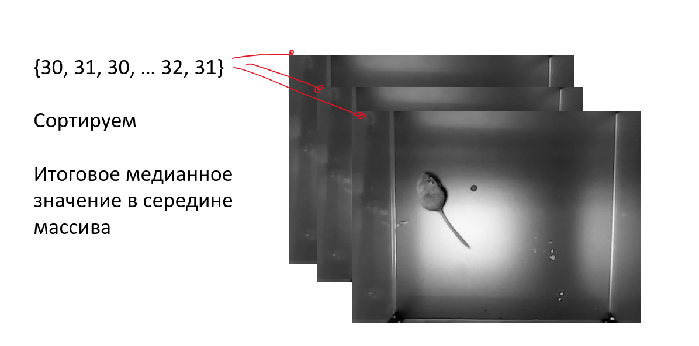
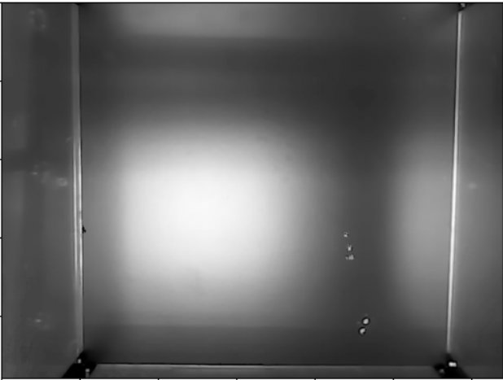
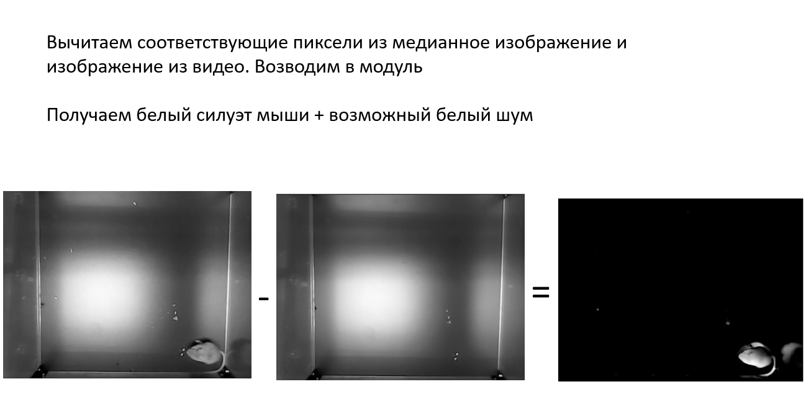
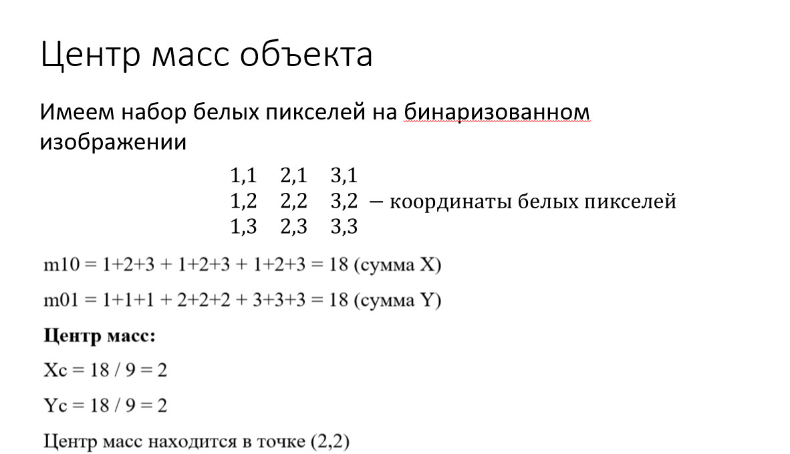
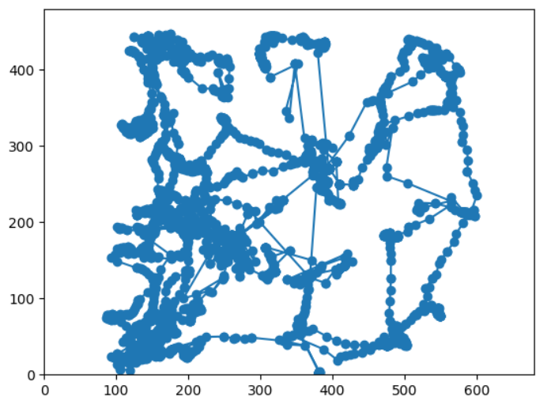

# Лабораторная работа №3
[Файл notebook лаб№3](../notebook/LAB№3.ipynb)

Цель: научится анализировать видео поток
1.	Реализуйте получение данных с Web камеры
2.	Реализуйте алгоритм вычитания фона
3.	Реализуйте определение движущегося предмета
4.	Постройте траекторию движения объекта.

## Загрузка видео и подготовка кадров
Было загружено видео (480x680) длительностью 5 минут, на которой происходит мышь передвигается в клетке. Видео в RGB, для дальнейшей работы потребуются изображения в сером формате. 

Всего было получено 6075 кадров.

## Получение изображение фона
Чтобы получить изображение фона необходимо взять 6075 кадров в совокупности. Для этого был применят медианный метод, то есть из 6075 кадров было составлено изображение, где каждый пиксель - это медианное значение среди 6075 соответствующих пикселей.

## Выделение объекта из видео
### Вычитание изображений
При помощи фона изображения можно выделить на кадре мышь. Для этого необходимо вычесть изображения из видео полученное изображение фона, таким образом можно получить силуэт мыши на кадре.

### Бинаризованное изображение объекта

Чтобы получить оптимальное (дающее общее представление о положении мыши в кадре) выделение мыши, были применены следующие операции:
1. Для изображения фона и изображения всех кадров видео было выровнено освещение по всему кадру, то есть выравнивание гистограммы.
2. Для устранения шума на изображениях были применен медианный фильтр для результата вычитания
3. Непосредственно выделение мыши получено при помощи эрозии (для устранения мелких объектов и остаточного шума) и дилатация (для расширения силуэта движущегося объекта)

## Получение траектории движения

Из полученных изображений, содержащие выделенные объекты, необходимо получить координаты точек, по которому двигался данный объект.

Для этого было получено среднее арифметическое всех координат белых пикселей.

По полученным координатам всех точек была построена траектория движения мыши.
