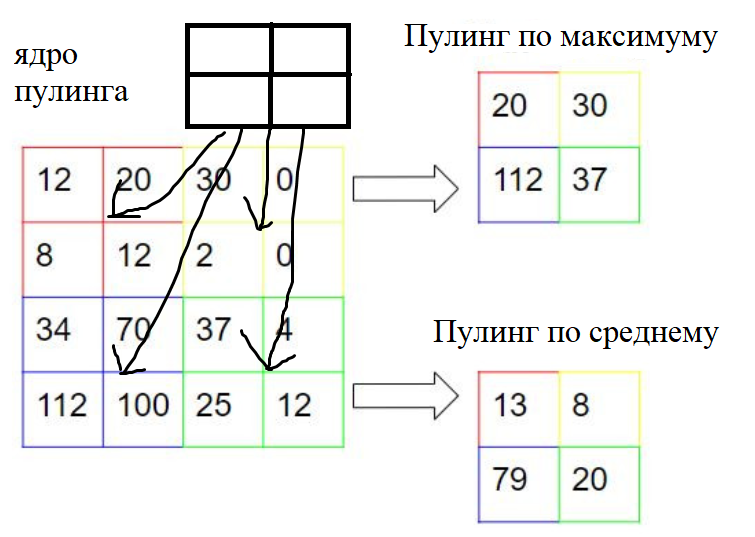
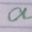
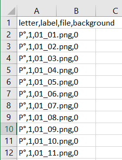
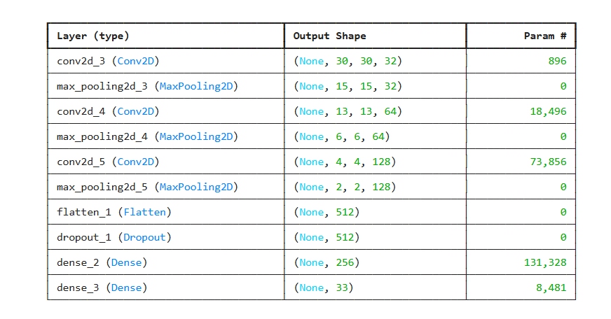
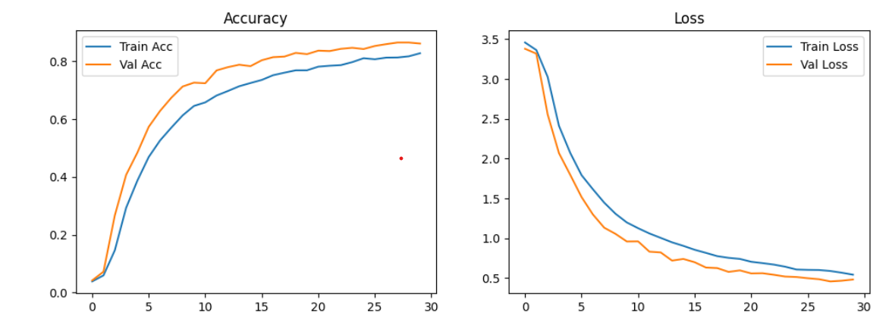
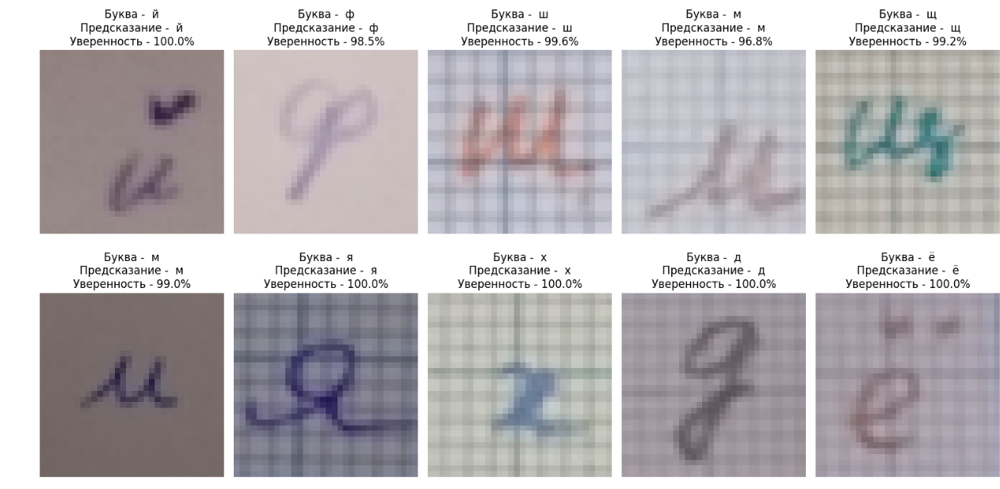

# Лабораторная работа №4
[Файл notebook лаб№4](../notebook/LAB4.ipynb)

Цель: создать модель нейронной сети для классификации изображений

## Основная идея сверточных нейронных сетей
Сверточные нейронные сети используют 2 основные операции - свертка и пулинг. 

Сверточный слой используется для выделения основной информации из изображения. Свертка осуществляется при помощи заранее заданных матриц как правило 3x3. После свертки получается матрица (карта признаков), которая в зависимости от правильности настройки весов ядра свертки может содержать информацию об объектах на изображении.  Каким образом задать ядро свертки есть задача машинного обучения.

**Гиперпараметры свёрточного слоя**:

- Размер ядра (kernel size) - обычно 3×3, 5×5, 1×1  
- Шаг (stride) - чаще всего 1 или 2  
- Нулевое заполнение (padding) - valid / same  
- Количество фильтров (число выходных каналов) - C_out

Пулинговый слой используется, чтобы уменьшить карту признаков и оставить наиболее явные признаки. Пулинг осуществляется при помощи операции, похожее на свертку, используется матрица, например 2x2, ядро пулинга проходится по матрице признаков и выбирает наиболее подходящее под условие значение.

Эти 2 операции могут использоваться многократно, чтобы оставить наименьшее количество наиболее значимых признаки для конечного слоя.

Типовая структура сверточных нейронныйх сетей
1. Сверточный слой 
2. Пулинговый слой
....
3. Пулинговый или сверточный слой
4. Слой преобразования матрицы в одномерный вектор
5. Полносвязные слои с функцией активации для взвешенной комбинации признаков
$$
Relu(x) = \max(0, x)
$$

$$
\text{softmax}(z_i) = \frac{e^{z_i}}{\sum_{j} e^{z_j}}
$$

6. Выходной полносвязный слой по числу классов 

## Выбор датасета и создание наборов данных
Выберем конкретную задачу классификации. Пусть это будет распознавание символов современного русского алфавита (33 символа!). Был выбран подходящий под данное описание датасет https://www.kaggle.com/datasets/tatianasnwrt/russian-handwritten-letters. Каждой букве присвоен порядковый номер, также дан тип заднего фона.

В Jupyter notebook данный датасет был разделен на обучающую, тестовую и проверочная (валидационная) выборки. 

Обучающая выборка - это выборка, под которую будут подстраиваться веса слоев нейронной сети

Проверочная выборка - это выборка для регуляризации обучения (предотвращения переобучения)

Тестовая выборка - это выборка для оценки обучения и проверки переобучения.

## Обучение модели

Необходимо определить структуру модели, то есть количество и типы слоев, количество признаков после каждого слоя и размерности ядер свертки и пулинга.

Далее при помощи библиотеки Keras производится обучение данной модели.

## Проверка модели
Для оценки работы модели машинного обучения используются метрики: функция потери (измеряет ошибку между предсказанием и реальным значением), точность (средняя правильность всех предсказаний)

